# Run Loop Podcast


## Как свести?
### TL;DR
1. Открываем все дорожки в Audacity
2. Убираем шум: на каждой дорожке ведущих/гостей применяем Noise reduction и накладываем Generate silence на участки тишины
3. Синхронизируем дорожки относительно общей
4. Удаляем всё лишнее в начале и в конце
5. Mix and render to new track
6. Truncate silence
7. Compressor
8. Limiter
9. Normalizer
10. Добавляем opening и closing музыку

### Основное правило
```
Сначала убираем, затем добавляем
```

### Советы
* Audacity-проект я держу в Git и делаю commit на каждом шаге. Git для такого, конечно, совсем не предназначен, и stage/checkout занимает безумное количество времени, но зато, если вскроется какой-то косяк, не придётся начинать с самого начала
* Когда нужно наложить тишину (`Generate -> Silence`) на участок дорожки, не совершайте моих ошибок и не делайте этого мышкой. Как оказалось, сочетание клавиш `Cmd+L` делает то же самое. Главное, случайно не нажать `Cmd+K`, т.к. оно удалит выбранный участок
* Hotkeys для zoom-кнопок можно настроить под себя (на какие-нибудь `Cmd+=` и `Cmd+-`), но даже без этого полезно иметь в виду две кнопки: 
    -  - сделает zoom на ширину текущего selection
    -  - сделает zoom на ширину всего проекта
* При накладывании почти любого эффекта есть кнопка `Preview`, которая быстренько применит эффект на короткий участок дорожки. Длительности такого участка по умолчанию обычно не хватает, поэтому можно его поднять (`Audacity -> Preferences -> Playback -> Effects Preview`)

### 1. Открываем все дорожки в Audacity
`File -> Import -> Audio` и выбираем общую дорожку и дорожки всех участников.
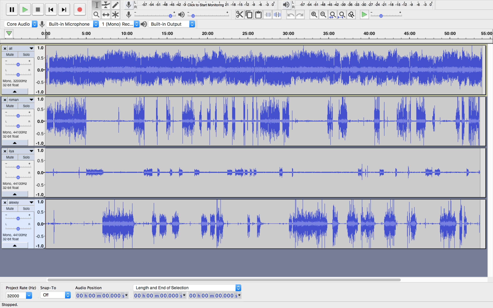
Мне обычно удобнее расположить общую дорожку наверху, а дальше по порядку вступления участников. Так потом проще синхронизировать

### 2. Убираем шум: на каждой дорожке ведущих/гостей применяем Noise reduction и накладываем Generate silence на участки тишины
Самая долгая и нудная стадия - будем давить шумы и руками накладывать silence на участки дорожки, где участник молчит, чтобы убрать всякие щелчки мышкой, поскрипывания кресла и, в некоторых случаях, голоса других участников, которые по какой-то причине уловил микрофон.

Для каждой дорожки (кроме общей, разумеется) выполняем три шага:
1. Выбираем участок тишины в начале, жмём `Effect -> Noise reduction -> Get noise profile`. Тут внимание: может появиться соблазн взять не кусок общего молчания в начале, а более длинный кусок где-то в середине. Почти всегда это хорошо, но если голоса других участников каким-то образом пробрались в дорожку, над которой мы сейчас работаем, то скорее всего голос довольно сильно попортится. Такие моменты нужно иметь в виду
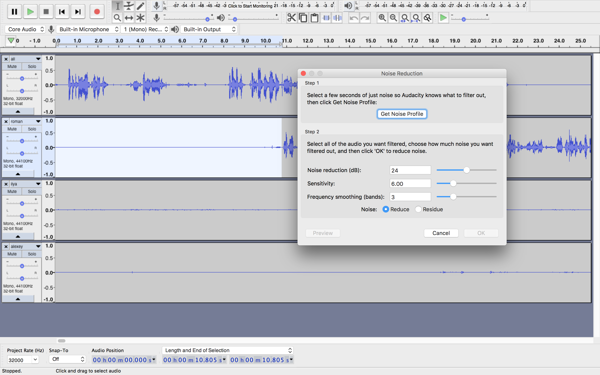
2. Выбираем всю дорожку, опять идём в `Effect -> Noise reduction`, выставляем параметры и жмём `OK`
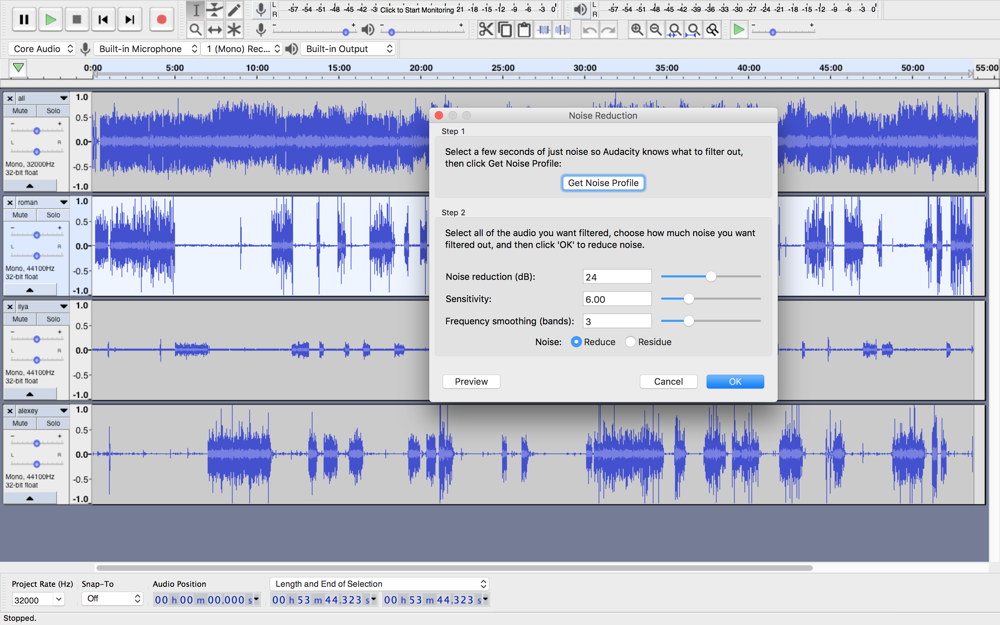
3. Теперь руками идём вдоль всей дорожки, выбираем участки молчания и накладываем на них silence (`Cmd+L`). Тут нужно быть аккуратным - нужно не пропустить маленькие пики с громкими посторонними звуками (клики мышкой, пришедшее на телефон сообщение), но и не удалить при этом короткие реплики или смешки, поскольку они зачастую важны. Этот же инструмент позволяет убрать громкие вдохи и причмокивания губами в моменты, когда участник только начинает говорить.

До:


После:
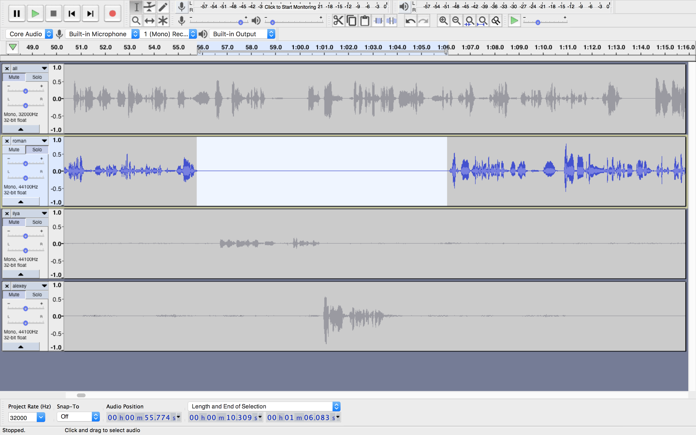

Повторив это для каждой дорожки, получим весьма чистый звук для каждого участника.

### 3. Синхронизируем дорожки относительно общей
Методом пристального взгляда и внимательного уха находим одинаковые места на общей дорожке и в самом начале первой реплики участника. Такие моменты можно определить даже визуально:
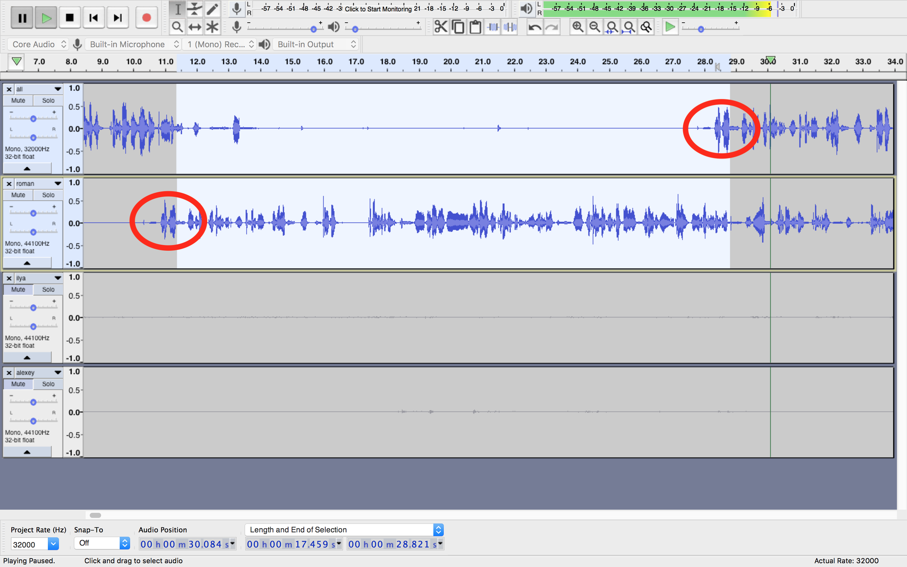

Выбираем инструмент, который позволяет дорожки двигать


Сдвигаем их примерно в одну позицию
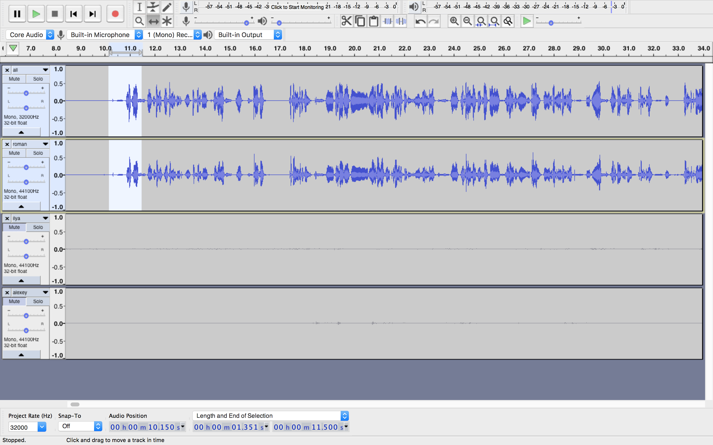

А теперь сильно приближаем, находим одинаковую форму "гребня" и, опираясь на selection выравниваем дорожки.
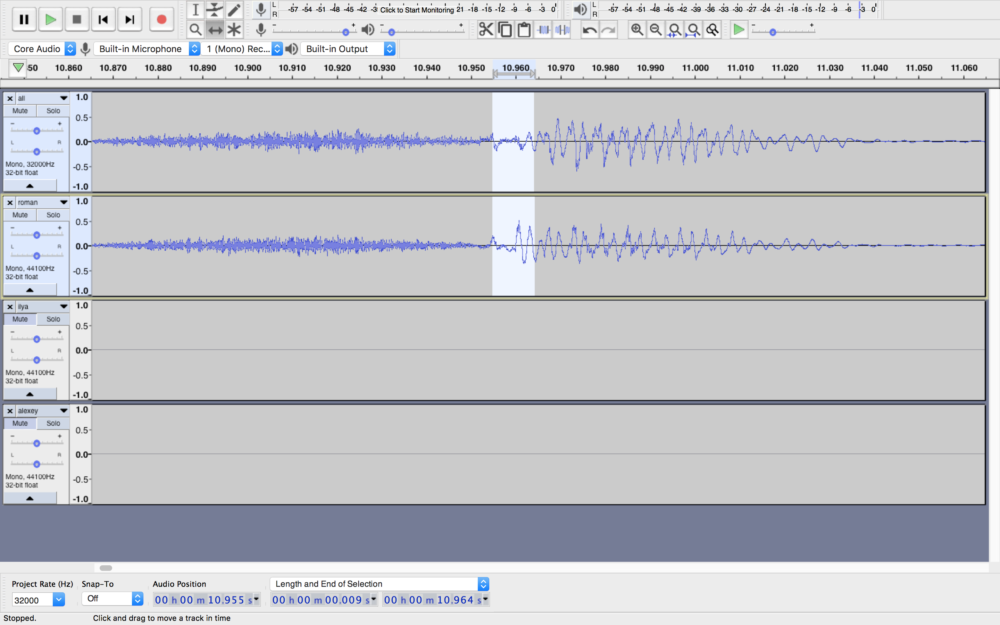

Если включить их вместе, они будут звучать почти идеально в унисон, но тут надо себя проверить: перематываем в конец подкаста и проигрываем общую и текущую. Они немного разойдутся, будет слышно эдакое эхо, но это нормально.

Эту же процедуру повторяем для других дорожек. Теперь мы синхронизированы. Можно со спокойной совестью удалить общую дорожку из проекта.

### 4. Удаляем всё лишнее в начале и в конце
После синхронизации дорожки могут не совсем ровно лежать относительно начала/конца проекта. Более того, в начале и в конце у нас по-прежнему куски тишины.


Выравниваем это дело относительно шкалы времени и удаляем ненужные куски. Внимательно: удаляя что-либо, нужно выбирать все дорожки, иначе можем получить рассинхрон.
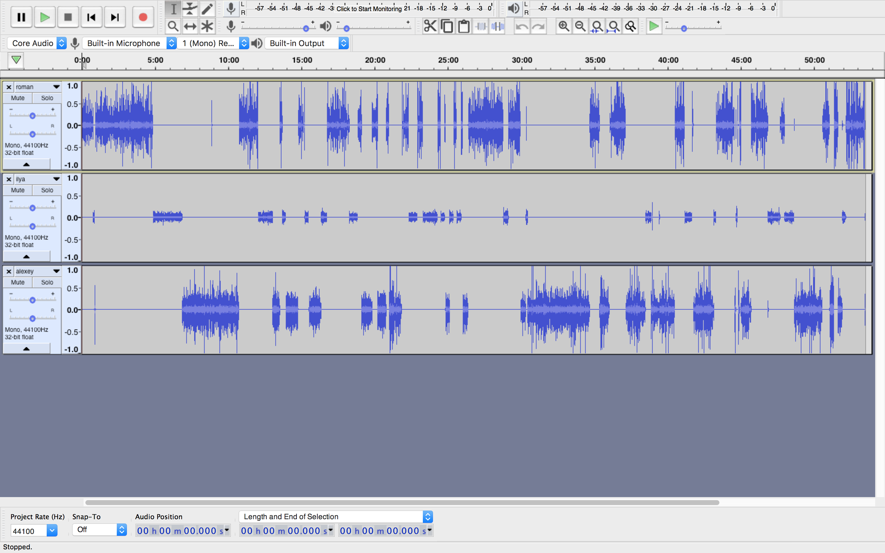

### 5. Mix and render to new track
Выделяем всё и объединяем все дорожки в одну: `Tracks -> Mix -> Mix and render to new track`. Сами дорожки из проекта удаляем, дальше будем работать только с одной


### 6. Truncate silence
С этого момента удобнее переключиться на Waveform (dB):


Выделяем всё, применяем `Effect -> Truncate silence`. Эта штука удалит все неловкие паузы, затянувшиеся молчания и т.п.


### 7. Compressor
Выделяем всё, применяем `Effect -> Compressor`:
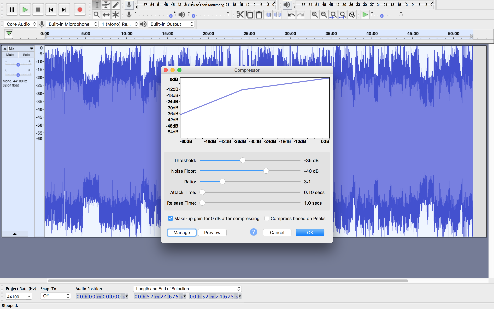
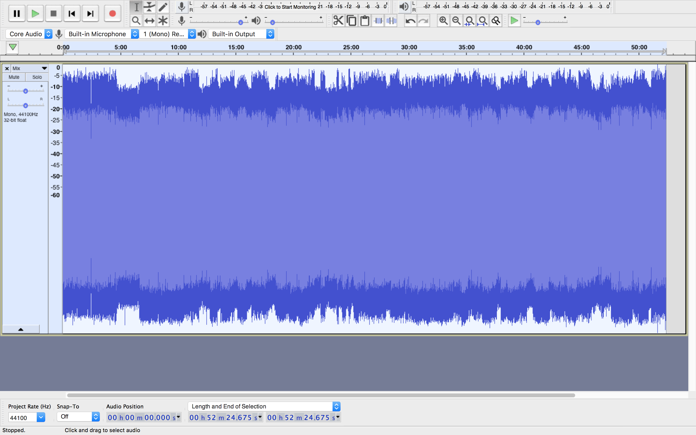

### 8. Limiter
Выделяем всё, применяем `Effect -> Limiter`:

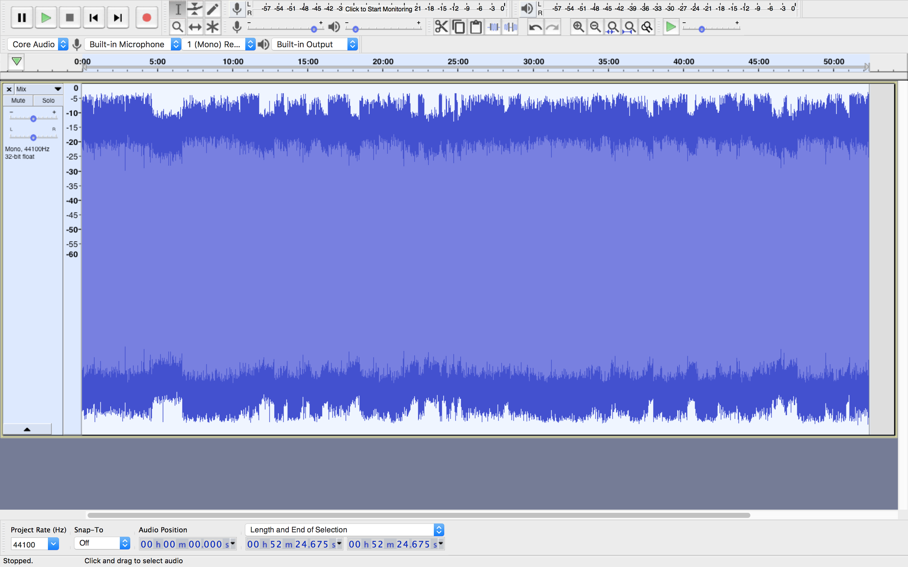

### 9. Normalizer
Выделяем всё, применяем `Effect -> Normalize`:
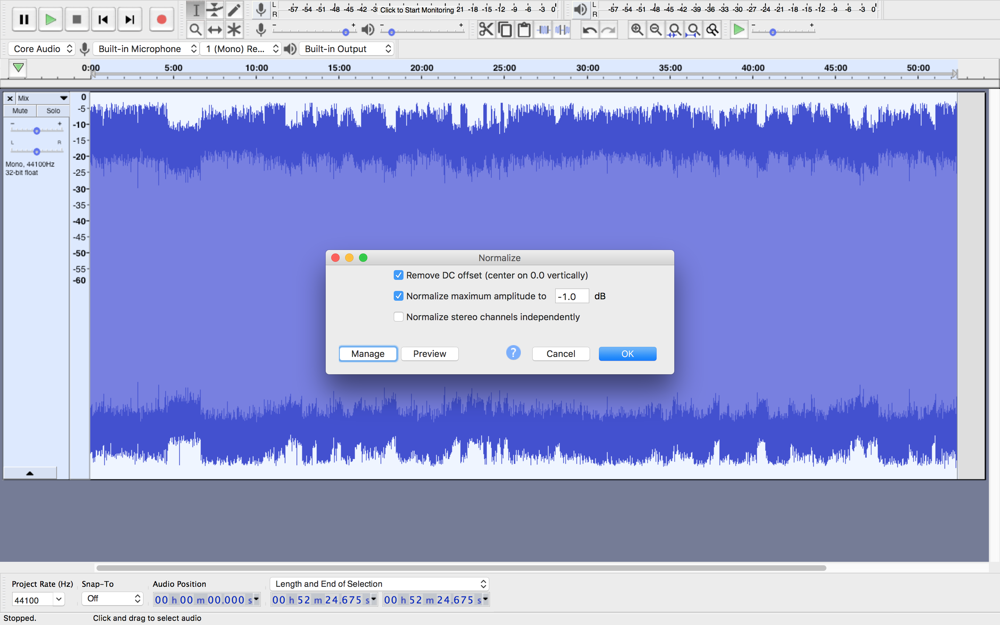
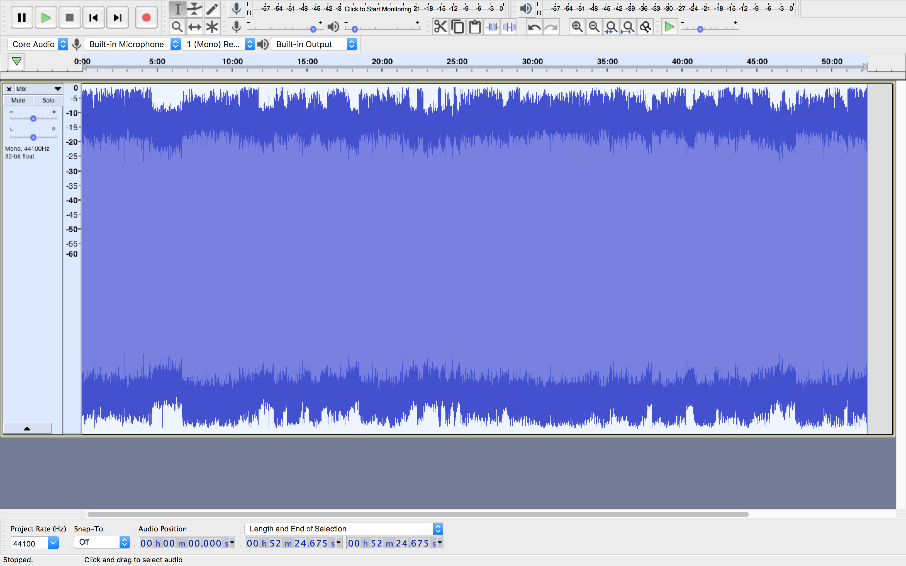

### 10. Добавляем opening и closing музыку
Импортируем файл `sound/processed-opening.wav`, сдвигаем основную дорожку относительно него:
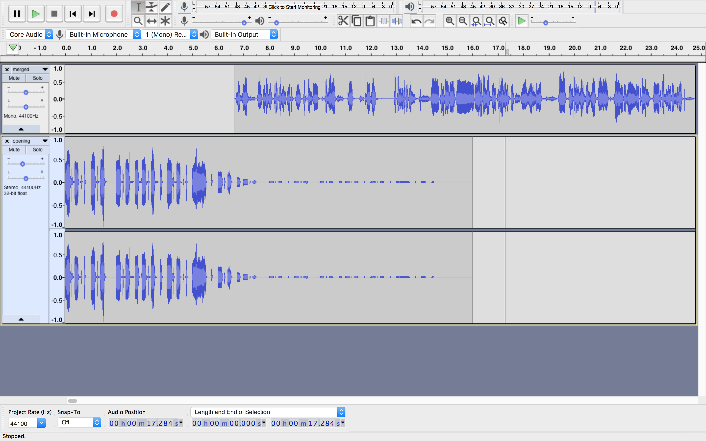
Аналогично для файла `sound/processed-closing.wav`:
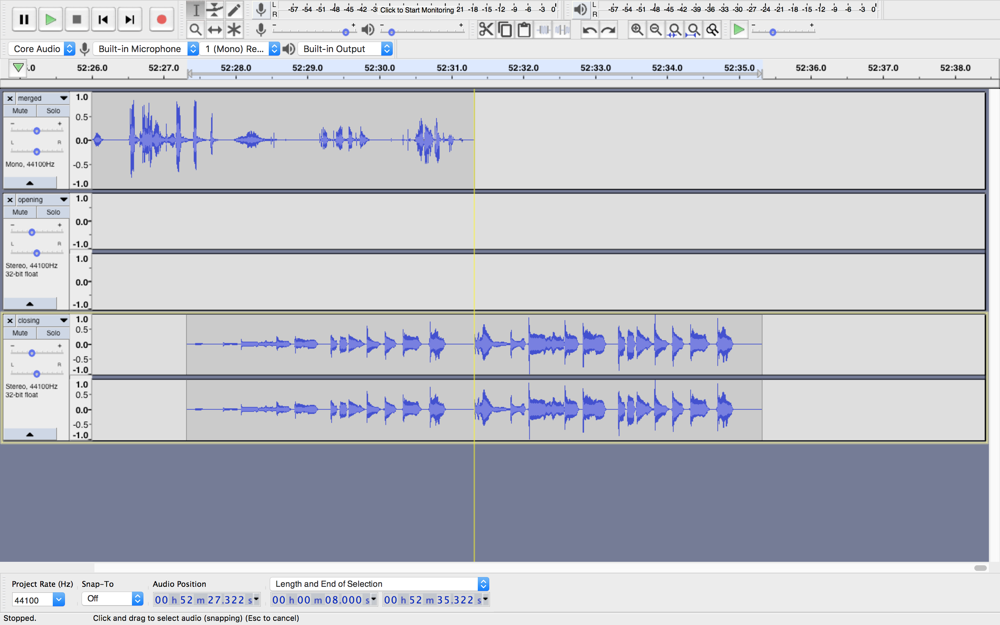
На этом всё, со спокойной совестью экспортируем в mp3 и слушаем, что получилось:
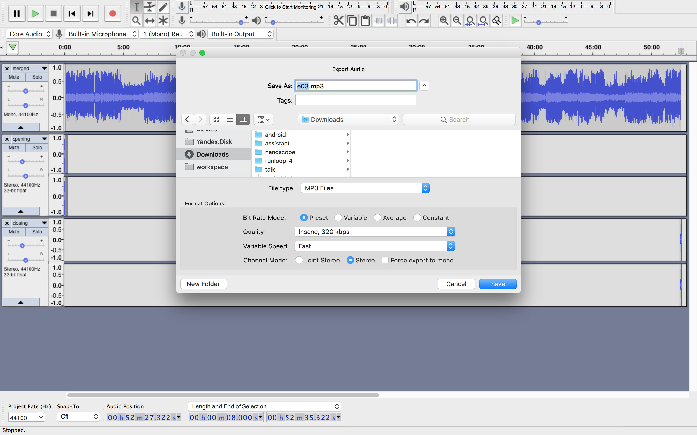


### Материалы по теме
- [Краткий курс молодого подкастера, по версии Umputun](https://docs.google.com/document/d/1ZK2_BuRZeX-H_kNVE45Z2qJemCmiUyYtxPUM7nZpvJQ/preview)
- [Как происходит запись и обработка подкаста DevZen](https://forum.devzen.ru/t/kak-proishodit-zapis-i-obrabotka-podkasta-devzen/296)
- [Подкаст Теория и Практика звукозаписи](http://tipz.umputun.com)
- [Архив ТиПЗ в Telegram](https://t.me/umputun_tipz)
